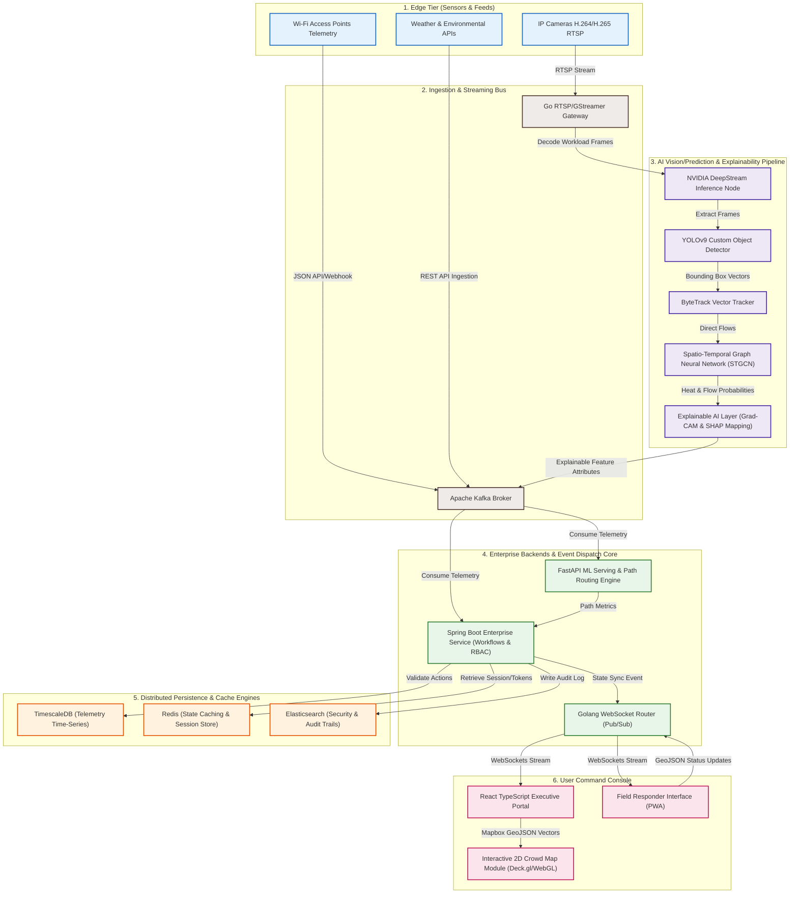
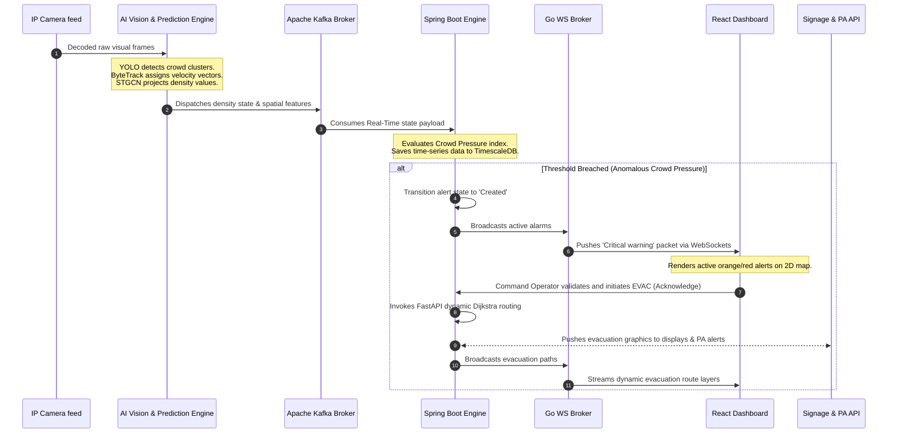
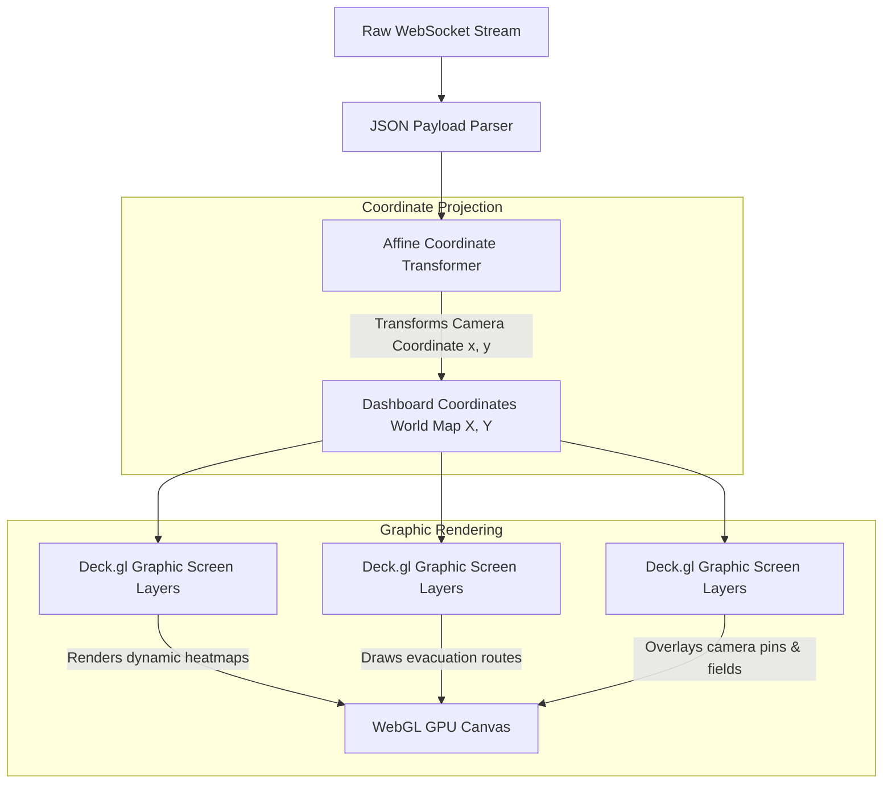
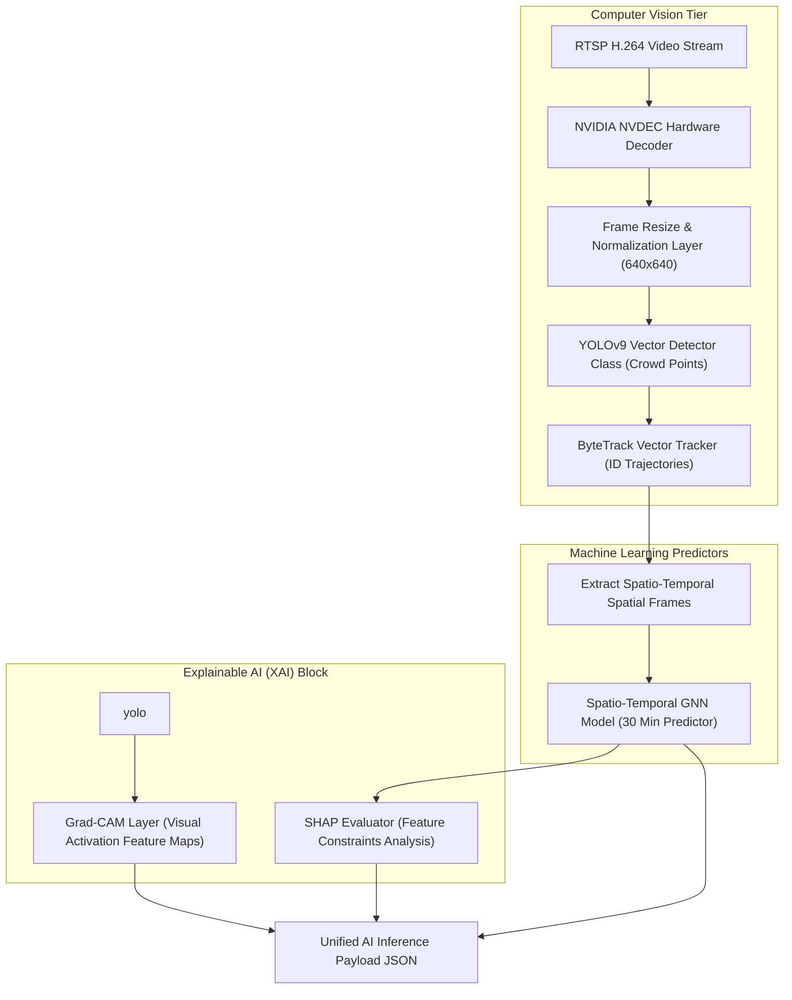
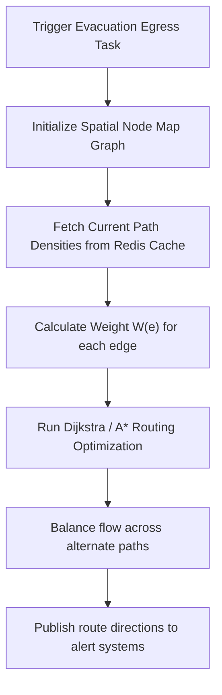
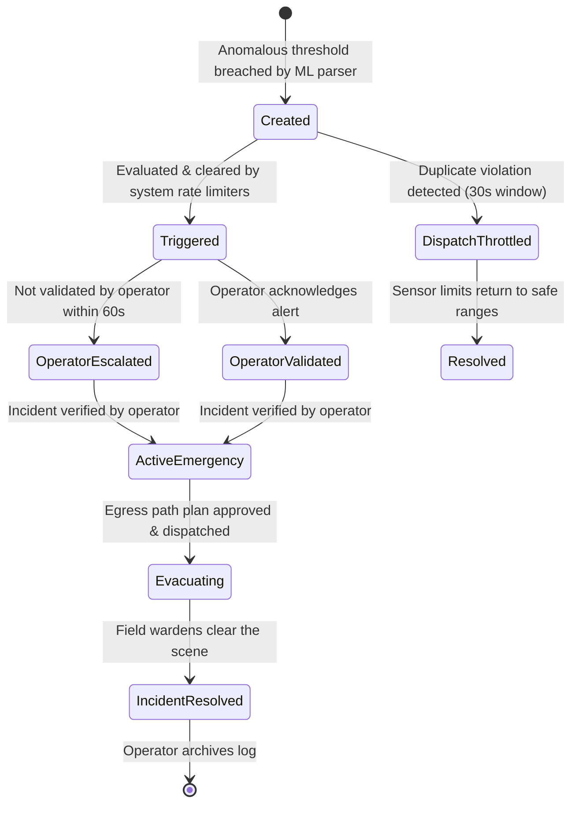

# HIGH-LEVEL & LOW-LEVEL ARCHITECTURE DESIGN (HLD / LLD)
## NEXORA: AI-Powered Predictive Crowd Intelligence & Decision Support Platform
### Document Version: V1.0-ARCHITECTURAL-BLUEPRINT

---

## 1. High-Level Architecture (HLD)

The HLD illustrates the end-to-end telemetry and command-control pathways for NEXORA. Designed for massive scalability, low latency, and modularity, the architecture isolates stream ingestion, heavy GPU vision parsing, predictive graph analytics, persistent data layers, and real-time frontend visualization.

### 1.1 Core System Topology Diagram
The following Mermaid diagram maps out the physical and logical flow of telemetry data from the edge camera arrays down to the operations dashboard.



### 1.2 System Execution & Message Sequence

This sequence outline shows the process from the moment a camera captures video, through ML forecasting and anomaly detection, to the emergency management dispatch workflow.



---

## 2. Low-Level Architecture (LLD)

---

### 2.1 Frontend Console Architecture
The NEXORA Single-Page Application (SPA) is built with React 18, TypeScript, and a highly responsive, custom CSS-driven UI.

```
                              FRONTEND MODULE STRUCTURE
                              
             +---------------------------------------------------------+
             |                 React 18 Context / App                  |
             +----------------------------+----------------------------+
                                          |
        +---------------------------------+---------------------------------+
        v                                 v                                 v
+------------------+              +------------------+              +------------------+
|   State Store    |              |  Map View Engine |              | Alert Controller |
| (Zustand Schema) |              |   (WebGL/Deck.gl)|              | (Socket Hooks)   |
+--------+---------+              +--------+---------+              +--------+---------+
         |                                 |                                 |
         |  Subscription Telemetry         |  Renders GeoJSON                |  Processes
         v                                 v                                 v
+------------------+              +------------------+              +------------------+
| API Client layer |              |  2D / 3D Canvas  |              | Active Alerts UI |
|  (React Query)   |              |  (Vector Overlays|              | Operational Logs |
+------------------+              +------------------+              +------------------+
```

#### State Management Schema
A global state manager processes high-affinity telemetry from WebSockets. State data splits into:
*   **Viewport state:** User bounds, map zoom levels, camera layer visibility.
*   **Dynamic telemetry store:** Real-time crowd count mappings, spatial velocity lists, and active cluster points.
*   **Alert queue:** Ordered list of unresolved violations, including coordinates and severity labels.

#### Components Hierarchy
1.  **DashboardLayout:** Incorporates the map canvas and overlays.
    *   **Interactive2DMap:** Renders spatial boundaries, heatmap gradients, and active camera pins.
    *   **SideAnalyticsPanel:** Displays real-time charts (Commuter influx, total headcount, speed metrics).
    *   **AlertTriageConsole:** Visualizes alarms, dynamic checklists, and dispatcher dispatch buttons.
    *   **SystemIntegrityOverlay:** Tracks camera status and system latencies.

---

### 2.2 Interactive 2D Crowd Map Module
The core visual component of NEXORA translates spatial telemetry into graphical layers using Deck.gl overlaying Mapbox GL JS vectors.



#### Screen Transformation Math
Telemetry provides cluster coordinates in raw local camera pixel coordinates $(x_{pixel}, y_{pixel})$. The map uses a Homography Matrix $H_{3x3}$ to project these onto georeferenced dashboard map coordinates $(X_{map}, Y_{map})$:

$$\begin{bmatrix} X_{map} \\ Y_{map} \\ 1 \end{bmatrix} \approx H \begin{bmatrix} x_{pixel} \\ y_{pixel} \\ 1 \end{bmatrix}$$

$$H = \begin{bmatrix} h_{11} & h_{12} & h_{13} \\ h_{21} & h_{22} & h_{23} \\ h_{31} & h_{32} & h_{33} \end{bmatrix}$$

#### Heatmap Grid Rasterization
Density heatmaps are rendered using a 2D Gaussian Kernel distribution centered on each crowd point. The intensity value $I$ at target map location $\mathbf{p} = (X, Y)$ is defined as:

$$I(\mathbf{p}) = \sum_{i=1}^{N} w_i \cdot \exp\left(-\frac{\|\mathbf{p} - \mathbf{c}_i\|^2}{2\sigma^2}\right)$$

Where:
*   $\mathbf{c}_i$ is the center coordinate of crowd node cluster $i$.
*   $w_i$ is the density weight value (derived from count estimations).
*   $\sigma$ is the kernel bandwidth parameter (adjusts resolution blur based on map zoom levels).
*   The GPU shader rasterizes this grid, converting scalar intensities to a custom color gradient (green $\to$ yellow $\to$ orange $\to$ red).

---

### 2.3 Backend Engine & Core Services
NEXORA utilizes a polyglot microservice backend:
1.  **Golang Gateway:** High-speed gateway routing frame data and maintaining active WebSocket sessions.
2.  **Spring Boot Core:** Manages user permissions, configuration limits, relational entities, workflow logging, and external integrations.
3.  **FastAPI Service Layer:** Wraps predictive AI inference calls and pathfinding query routines.

```
                             BACKEND SERVICES OVERVIEW
                             
+----------------------+     +----------------------+     +----------------------+
|    Go Gateway        |     |   Spring Boot Core   |     |   FastAPI Service    |
| - RTSP Demux         |     | - Access Control     |     | - ML Serving Routing |
| - High-Throughput WS |     | - Workflows & Logs   |     | - Route Planning     |
+----------+-----------+     +----------+-----------+     +----------+-----------+
           |                            |                            |
           +----------------------------+----------------------------+
                                        |
                                        v
                    Time Series Metrics, System State, Logs
```

#### Core Data Ingestion Interface (Go)
```go
package ingestion

import (
	"context"
	"time"
)

type SpatialPoint struct {
	XCoord    float64 `json:"x_coordinate"`
	YCoord    float64 `json:"y_coordinate"`
	Intensity float64 `json:"intensity"`
}

type AggregatedFrameTelemetry struct {
	SourceCameraID string         `json:"camera_id"`
	Timestamp      time.Time      `json:"timestamp"`
	ZoneIdentifier string         `json:"zone_id"`
	TotalHeadCount int            `json:"total_headcount"`
	FlowRateInFlow float64        `json:"flow_inflow_rate"`
	FlowRateOut    float64        `json:"flow_outflow_rate"`
	DensityMap     []SpatialPoint `json:"density_points"`
}

type TelemetryConsumer interface {
	ConsumeFrames(ctx context.Context, handler func(telemetry AggregatedFrameTelemetry) error) error
}
```

---

### 2.4 WebSocket Layer
Handles real-time communication between backends and client dashboards.

*   **Subprotocols:** Custom JSON frames.
*   **Connection Lifecycle:**
    ```
    Client Connect -> Handshake & JWT Auth -> Access Approved -> Subscribed to Zone -> Heartbeat Loop -> Connection Terminated
    ```

#### JSON Wire Format Specifications
##### 1. Client Subscription Payload
```json
{
  "event_action": "SUBSCRIBE_ZONE",
  "auth_token": "bearer_jwt_string_token",
  "client_timestamp": 1783637152000,
  "payload": {
    "monitored_zone_ids": ["ZONE_EAST_TERMINAL", "ZONE_PLAZA_A"]
  }
}
```

##### 2. Real-Time Telemetry Event Frame (Backend Broadcast)
```json
{
  "event_action": "TELEMETRY_UPDATE",
  "server_timestamp": 1783637152430,
  "payload": {
    "zone_id": "ZONE_EAST_TERMINAL",
    "criticality_index": 0.42,
    "current_headcount": 524,
    "average_velocity": {"dx": -1.25, "dy": 0.35},
    "anomalies_detected": [],
    "heat_points": [
      {"x": 12.35, "y": 84.62, "density": 3.8},
      {"x": 14.50, "y": 80.12, "density": 4.2}
    ]
  }
}
```

##### 3. Heartbeat Frame (Client to Server Ping / Server Pong)
```json
{
  "event_action": "PING",
  "client_timestamp": 1783637155000
}
```

---

### 2.5 AI Engine: Computer Vision, Machine Learning & Explainable AI (XAI)
The vision pipeline takes video streams as inputs and outputs spatial feature coordinates, anomalies, and safety predictions.



#### 2.5.1 Computer Vision Pipeline
- **Decoding:** NVIDIA hardware-accelerated GStreamer plugins parse the video stream.
- **Detector:** Customized YOLOv9 model optimized to detect human heads and shoulders in high-density scenes. Anchor configurations are optimized for top-down, high-occlusion camera angles.
- **Tracker:** ByteTrack matches candidates across frames using Kalman filters. If detection confidence drops below a threshold, it keeps the path active based on velocity trends, minimizing identity switches.

#### 2.5.2 Machine Learning Systems (STGCN Prediction)
The venue is represented as a spatial network using a Spatio-Temporal Graph Convolutional Network (STGCN).
*   **Graph Structure:** Areas (e.g., platforms, staircases) are defined as nodes $V_i$. Architectural paths between nodes are defined as edges $E_{ij}$, with weights based on corridor width and distance.
*   **Feature Matrix:** Each node records feature vectors $X_t \in \mathbb{R}^{V \times F}$ over time window $T$, tracking metrics like headcount, flow rate, and weather variables.
*   **Model Layers:** Spatial graph convolutions extract topological features, and Temporal gated-convolutional layers run sequential forecasts to project crowd density states at $t+5, t+15, \text{ and } t+30$ minutes.

#### 2.5.3 Explainable AI (XAI) Framework
Explainable AI elements help prevent false alarms and provide operators with contextual details on alerts:
1.  **Grad-CAM (Vision Explainability):** Generates hot-spot visual overlays indicating the image regions that contributed most to a density spike. This helps operators identify video issues or non-crowd obstructions.
2.  **SHAP Engine (Forecasting Explainability):** Calculates SHAP (SHapley Additive exPlanations) values to identify the environmental and spatial factors driving a prediction.
    *   *Example Output:* "Alert generated due to: Platform 2 arrival bottleneck ($+42\%$ contribution), escalator repair outage ($+28\%$), and rainy weather delays ($+15\%$)."

---

### 2.6 Persistence Layer & Databases
NEXORA utilizes dedicated data engines for time-series telemetry, application state, and logs.

```
                               PERSISTENCE MODULES
                               
+----------------------------+-----------------------+-------------------------+
|        TimescaleDB         |         Redis         |      Elasticsearch      |
|  - Real-time telemetry     |  - User sessions      |  - User audit trails    |
|  - Zone congestion logs    |  - Active state cache |  - Event diagnostics    |
|  - System alerts history   |  - API rate limits    |  - Exception traces     |
+----------------------------+-----------------------+-------------------------+
```

#### TimescaleDB Schema
```sql
-- Core Hypertable for Telemetry Data Points
CREATE TABLE camera_telemetry_metrics (
    recorded_time TIMESTAMP WITH TIME ZONE NOT NULL,
    camera_id VARCHAR(64) NOT NULL,
    zone_id VARCHAR(64) NOT NULL,
    headcount INT NOT NULL,
    average_velocity_x REAL,
    average_velocity_y REAL,
    congestion_ratio REAL
);
SELECT create_hypertable('camera_telemetry_metrics', 'recorded_time');

-- Create Index for Faster Query Retreivals
CREATE INDEX idx_camera_zone ON camera_telemetry_metrics (zone_id, recorded_time DESC);

-- Crowds Incident Tracking Storage
CREATE TABLE crowd_alert_records (
    record_id UUID PRIMARY KEY DEFAULT gen_random_uuid(),
    event_timestamp TIMESTAMP WITH TIME ZONE NOT NULL,
    zone_id VARCHAR(64) NOT NULL,
    severity_level VARCHAR(16) NOT NULL, -- 'YELLOW', 'ORANGE', 'RED'
    anomaly_type VARCHAR(64) NOT NULL, -- 'BOTTLENECK', 'STAMPEDE_PRECURSOR', 'FALL_DETECTED'
    trigger_value REAL,
    resolution_status VARCHAR(24) NOT NULL -- 'CREATED', 'OPERATOR_ACK', 'RESOLVED'
);
```

#### Redis Key-Value Store Specifications
- **Real-Time System State:**
  - Key: `state:camera:{camera_id}` -> Type: Hash. Holds current count, status (ACTIVE, offline), and last sync time. TTL: `180` seconds.
- **WebSocket Session Registry:**
  - Key: `websocket:client:{user_id}:{connection_id}` -> Type: String. Holds user credentials and active channel list. TTL: `86400` seconds.
- **Alert Rate Limiter:**
  - Key: `throttle:alert:{zone_id}:{anomaly_type}` -> Type: String. Used to throttle repeat alerts. TTL: `30` seconds.

#### Elasticsearch Index Patterns
*   **Index Name:** `nexora-audit-logs-yyyy.mm.dd`
*   **Structure:** Tracks developer logs and operator actions (e.g., changes to configuration settings, user logins, incident status updates).

---

### 2.7 Analytics & Emergency Alert System
The Decision Support Engine implements alerting workflows and route-optimization models during emergencies.

#### Density-Weighted Routing Algorithm
During evacuations, static routing (shortest path) can funnel large volumes of people into existing bottle-necks, worsening crush conditions. The routing engine recalculates egress routes dynamically using a density-weighted path cost formula:

$$W(e) = L(e) \cdot \left[ 1 + \kappa \cdot \left( \frac{D(e)}{D_{critical}} \right)^\gamma \right]$$

Where:
*   $W(e)$ is the calculated cost weight of network path edge $e$.
*   $L(e)$ is the physical length of the corridor/staircase.
*   $D(e)$ is the current density (people per $\text{m}^2$) detected by camera vision models.
*   $D_{critical}$ is the safe density limit ($3.0\text{ persons/m}^2$).
*   $\kappa$ and $\gamma$ are adjustment parameters that rapidly scale path costs as densities enter critical zones.



#### Alert Validation State Machine
The life-cycle of alerts is managed by a state engine to ensure all warnings are systematically tracked.



#### External Integration Layer APIs
The alert manager dispatches alerts to external channels:
1.  **PA Integration Handler:** Pushes pre-recorded audio tracks to the target public address zone.
2.  **Visual Signage Hook:** Posts custom evacuation maps and arrows to digital signage platforms via REST API.
3.  **Field Messenger Integration:** Dispatches alerts to nearby field marshals via SMS/Push JSON payloads.
