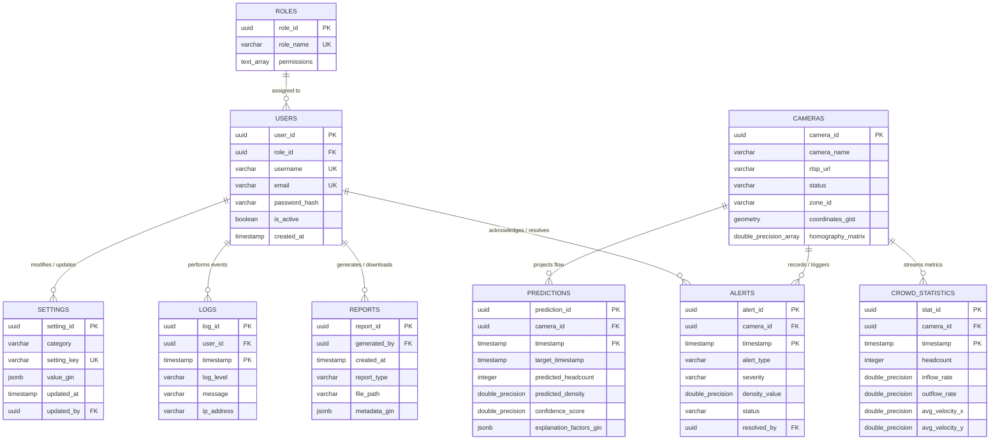

# DATABASE ARCHITECTURE & SCHEMA SPECIFICATION (POSTGRESQL & TIMESCALEDB)
## NEXORA: AI-Powered Predictive Crowd Intelligence & Decision Support Platform
### Document Version: V1.0-DATABASE-SCHEMA

This framework defines the persistence layer for NEXORA. It leverages PostgreSQL for structural system records and the TimescaleDB extension to support high-frequency time-series crowd statistics, model predictions, and event logs.

---

## 1. Entity Relationship (ER) Diagram

The following Mermaid diagram outlines the relational structure, primary keys, foreign keys, and connectivity rules for the database.



---

## 2. Table Schemas & Structured Definitions

### 2.1 Table: Roles
Stores access groups and permission vectors.
*   **`role_id`** (UUID, PK): Unique ID.
*   **`role_name`** (VARCHAR, UK): Role designation (e.g., `SYSTEM_ADMIN`, `COMMAND_OPERATOR`).
*   **`permissions`** (TEXT[]): List of approved action permissions (e.g., `READ_TELEMETRY`, `CALIBRATE_CAMERAS`).

### 2.2 Table: Users
Stores authentication and profile records.
*   **`user_id`** (UUID, PK): Unique user ID.
*   **`role_id`** (UUID, FK): Links to `Roles`.
*   **`username`** (VARCHAR, UK): Account username.
*   **`email`** (VARCHAR, UK): Contact email.
*   **`password_hash`** (VARCHAR): Salted password hash (BCrypt).
*   **`is_active`** (BOOLEAN): Status flag.
*   **`created_at`** (TIMESTAMP WITH TIME ZONE): Profile creation time.

### 2.3 Table: Cameras
Stores spatial assets, streaming endpoints, and projection metrics.
*   **`camera_id`** (UUID, PK): Unique camera ID.
*   **`camera_name`** (VARCHAR): Physical label.
*   **`rtsp_url`** (VARCHAR): RTSP video stream link.
*   **`status`** (VARCHAR): Operating status (`ACTIVE`, `INACTIVE`, `FAILED`).
*   **`zone_id`** (VARCHAR): Links to physical zones (e.g., `ZONE_PLATFORM_1`).
*   **`coordinates`** (GEOMETRY): GPS coordinates (Point spatial representation, SRID 4326).
*   **`homography_matrix`** (DOUBLE PRECISION[]): $3 \times 3$ matrix array for converting pixel points to map coordinates.

### 2.4 Table: Alerts [Hypertable]
Logs anomaly alerts generated by the system.
*   **`alert_id`** (UUID): Unique ID.
*   **`camera_id`** (UUID, FK): Src camera generating the alert.
*   **`timestamp`** (TIMESTAMP WITH TIME ZONE): Alert trigger time.
*   **`alert_type`** (VARCHAR): Anomaly type (`BOTTLENECK`, `VELOCITY_DEVIATION`).
*   **`severity`** (VARCHAR): Danger category (`YELLOW`, `ORANGE`, `RED`).
*   **`density_value`** (DOUBLE PRECISION): Density value at trigger time.
*   **`status`** (VARCHAR): Alert resolution status (`CREATED`, `OPERATOR_ACK`, `RESOLVED`).
*   **`resolved_by`** (UUID, FK): Operator resolving the alert. References `Users`.

### 2.5 Table: CrowdStatistics [Hypertable]
Time-series table logging crowd count profiles from camera feeds.
*   **`stat_id`** (UUID): Unique ID.
*   **`camera_id`** (UUID, FK): Source camera sensor link.
*   **`timestamp`** (TIMESTAMP WITH TIME ZONE): Sample collection time.
*   **`headcount`** (INTEGER): Calculated headcount.
*   **`inflow_rate`** (DOUBLE PRECISION): Commuters entering per sec.
*   **`outflow_rate`** (DOUBLE PRECISION): Commuters exiting per sec.
*   **`avg_velocity_x`** (DOUBLE PRECISION): X-axis flow velocity vector.
*   **`avg_velocity_y`** (DOUBLE PRECISION): Y-axis flow velocity vector.

### 2.6 Table: Predictions [Hypertable]
Stores model predictions for ahead-of-time crowd trends.
*   **`prediction_id`** (UUID): Unique ID.
*   **`camera_id`** (UUID, FK): Target camera model link.
*   **`timestamp`** (TIMESTAMP WITH TIME ZONE): Execution timestamp.
*   **`target_timestamp`** (TIMESTAMP WITH TIME ZONE): Future targeted projection timestamp ($T+15$).
*   **`predicted_headcount`** (INTEGER): Projected density peaks count.
*   **`predicted_density`** (DOUBLE PRECISION): Projected density value.
*   **`confidence_score`** (DOUBLE PRECISION): Prediction probability margin ($0.0 \to 1.0$).
*   **`explanation_factors`** (JSONB): SHAP contribution parameters outlining target metrics.

### 2.7 Table: Reports
Logs compiled system and compliance exports.
*   **`report_id`** (UUID, PK): Unique ID.
*   **`generated_by`** (UUID, FK): Operator generating file. References `Users`.
*   **`created_at`** (TIMESTAMP WITH TIME ZONE): Document creation time.
*   **`report_type`** (VARCHAR): File category (`COMPLIANCE`, `SAFETY_AUDIT`, `PERFORMANCE`).
*   **`file_path`** (VARCHAR): Storage path (S3 or secure NFS link).
*   **`metadata`** (JSONB): File profile data (e.g., date ranges, file sizes).

### 2.8 Table: Logs [Hypertable]
Time-series log repository.
*   **`log_id`** (UUID): Unique ID.
*   **`user_id`** (UUID, FK): Action user. References `Users`.
*   **`timestamp`** (TIMESTAMP WITH TIME ZONE): Log entry creation time.
*   **`log_level`** (VARCHAR): Flag category (`INFO`, `WARN`, `ERROR`, `AUDIT`).
*   **`message`** (TEXT): Log description.
*   **`ip_address`** (VARCHAR): Operator IP address.

### 2.9 Table: Settings
Manages platform configurations.
*   **`setting_id`** (UUID, PK): Unique setting ID.
*   **`category`** (VARCHAR): Setup section (`AI_DEVIATIONS`, `SMS_CONFIG`, `SYSTEM_SAMPLING`).
*   **`setting_key`** (VARCHAR, UK): Option configuration code (e.g., `ALERT_DENSITY_RED_VAL`).
*   **`value`** (JSONB): Setting configuration values mapping parameters.
*   **`updated_at`** (TIMESTAMP WITH TIME ZONE): Setting update timestamp.
*   **`updated_by`** (UUID, FK): User saving modifications. References `Users`.

---

## 3. Database Normalization & Performance De-normalization

### Normalization Baseline (3NF compliance)
The relational system schema (Roles, Users, Cameras, Reports, Settings) complies with 3rd Normal Form (3NF):
1.  **1NF (First Normal Form):** All fields contain atomic values, with primary keys identifying rows uniquely.
2.  **2NF (Second Normal Form):** Tables resolve partial dependencies, mapping all non-key properties strictly to the full primary key.
3.  **3NF (Third Normal Form):** Removed transitive dependencies. For example, user permissions are mapped to Role records in `Roles` rather than directly to user rows.

### Performance De-normalization Strategies
To handle high-throughput telemetry streams (500+ streams feeding data at sub-second intervals), selected time-series tables use de-normalized configurations to bypass complex, high-CPU join operations during writes:
*   **`Alerts`:** Includes `density_value` directly. While this could be calculated from `CrowdStatistics`, duplication avoids costly join operations when validating and routing active alarms.
*   **`Predictions`:** The `explanation_factors` column stores SHAP attribution parameters as a JSONB object, avoiding the need for deep sub-tables and joins for each prediction vector.

---

## 4. SQL Schema Definitions (PostgreSQL DDL)

To run the schema, initialize the **PostGIS** and **TimescaleDB** extensions:

```sql
-- Step 1: Active extensions configurations
CREATE EXTENSION IF NOT EXISTS postgis;
CREATE EXTENSION IF NOT EXISTS timescaledb CASCADE;

-- Step 2: Create Roles Table
CREATE TABLE roles (
    role_id UUID PRIMARY KEY DEFAULT gen_random_uuid(),
    role_name VARCHAR(64) UNIQUE NOT NULL,
    permissions TEXT[] NOT NULL
);

-- Step 3: Create Users Table
CREATE TABLE users (
    user_id UUID PRIMARY KEY DEFAULT gen_random_uuid(),
    role_id UUID NOT NULL REFERENCES roles(role_id) ON DELETE RESTRICT,
    username VARCHAR(128) UNIQUE NOT NULL,
    email VARCHAR(256) UNIQUE NOT NULL,
    password_hash VARCHAR(256) NOT NULL,
    is_active BOOLEAN NOT NULL DEFAULT TRUE,
    created_at TIMESTAMP WITH TIME ZONE DEFAULT CURRENT_TIMESTAMP NOT NULL
);

-- Step 4: Create Cameras Table
CREATE TABLE cameras (
    camera_id UUID PRIMARY KEY DEFAULT gen_random_uuid(),
    camera_name VARCHAR(128) NOT NULL,
    rtsp_url VARCHAR(512) NOT NULL,
    status VARCHAR(32) NOT NULL DEFAULT 'ACTIVE',
    zone_id VARCHAR(64) NOT NULL,
    coordinates GEOMETRY(POINT, 4326) NOT NULL,
    homography_matrix DOUBLE PRECISION[] NOT NULL
);

-- Step 5: Create Alerts Table (Time-Series Configuration)
CREATE TABLE alerts (
    alert_id UUID NOT NULL,
    camera_id UUID NOT NULL REFERENCES cameras(camera_id) ON DELETE CASCADE,
    timestamp TIMESTAMP WITH TIME ZONE NOT NULL,
    alert_type VARCHAR(64) NOT NULL,
    severity VARCHAR(16) NOT NULL,
    density_value DOUBLE PRECISION NOT NULL,
    status VARCHAR(32) NOT NULL DEFAULT 'CREATED',
    resolved_by UUID REFERENCES users(user_id) ON DELETE SET NULL,
    PRIMARY KEY (alert_id, timestamp)
);

-- Step 6: Create CrowdStatistics Table (Time-Series Configuration)
CREATE TABLE crowd_statistics (
    stat_id UUID NOT NULL,
    camera_id UUID NOT NULL REFERENCES cameras(camera_id) ON DELETE CASCADE,
    timestamp TIMESTAMP WITH TIME ZONE NOT NULL,
    headcount INT NOT NULL,
    inflow_rate DOUBLE PRECISION NOT NULL,
    outflow_rate DOUBLE PRECISION NOT NULL,
    avg_velocity_x DOUBLE PRECISION NOT NULL,
    avg_velocity_y DOUBLE PRECISION NOT NULL,
    PRIMARY KEY (stat_id, timestamp)
);

-- Step 7: Create Predictions Table (Time-Series Configuration)
CREATE TABLE predictions (
    prediction_id UUID NOT NULL,
    camera_id UUID NOT NULL REFERENCES cameras(camera_id) ON DELETE CASCADE,
    timestamp TIMESTAMP WITH TIME ZONE NOT NULL,
    target_timestamp TIMESTAMP WITH TIME ZONE NOT NULL,
    predicted_headcount INT NOT NULL,
    predicted_density DOUBLE PRECISION NOT NULL,
    confidence_score DOUBLE PRECISION NOT NULL,
    explanation_factors JSONB NOT NULL,
    PRIMARY KEY (prediction_id, timestamp)
);

-- Step 8: Create Reports Table
CREATE TABLE reports (
    report_id UUID PRIMARY KEY DEFAULT gen_random_uuid(),
    generated_by UUID NOT NULL REFERENCES users(user_id) ON DELETE RESTRICT,
    created_at TIMESTAMP WITH TIME ZONE DEFAULT CURRENT_TIMESTAMP NOT NULL,
    report_type VARCHAR(64) NOT NULL,
    file_path VARCHAR(512) NOT NULL,
    metadata JSONB NOT NULL
);

-- Step 9: Create Logs Table (Time-Series Configuration)
CREATE TABLE logs (
    log_id UUID NOT NULL,
    user_id UUID REFERENCES users(user_id) ON DELETE SET NULL,
    timestamp TIMESTAMP WITH TIME ZONE NOT NULL,
    log_level VARCHAR(16) NOT NULL,
    message TEXT NOT NULL,
    ip_address VARCHAR(45) NOT NULL,
    PRIMARY KEY (log_id, timestamp)
);

-- Step 10: Create Settings Table
CREATE TABLE settings (
    setting_id UUID PRIMARY KEY DEFAULT gen_random_uuid(),
    category VARCHAR(64) NOT NULL,
    setting_key VARCHAR(128) UNIQUE NOT NULL,
    value JSONB NOT NULL,
    updated_at TIMESTAMP WITH TIME ZONE DEFAULT CURRENT_TIMESTAMP NOT NULL,
    updated_by UUID NOT NULL REFERENCES users(user_id) ON DELETE RESTRICT
);

-- Step 11: Convert time-series tables into TimescaleDB Hypertables
SELECT create_hypertable('alerts', 'timestamp');
SELECT create_hypertable('crowd_statistics', 'timestamp');
SELECT create_hypertable('predictions', 'timestamp');
SELECT create_hypertable('logs', 'timestamp');
```

---

## 5. Indexes & Query Performance Configurations

To ensure fast response times for spatial-temporal telemetry queries, the database implements the following performance indexes:

### 5.1 PostGIS Spatial GIST Index (on Coordinates)
Designed to accelerate proximity queries (e.g., retrieving cameras active within 50 meters of an incident).
```sql
CREATE INDEX idx_cameras_gist_coord ON cameras USING GIST (coordinates);
```

### 5.2 Composite Temporal Indexes (on Hypertables)
TimescaleDB creates a default B-tree index on the time partition column (`timestamp`). In addition, composite indexes map spatial and temporal variables to accelerate query response times on real-time dashboards:
```sql
-- Fast historical analysis path querying on target Camera arrays
CREATE INDEX idx_crowd_stats_cam_time ON crowd_statistics (camera_id, timestamp DESC);
CREATE INDEX idx_alerts_cam_time ON alerts (camera_id, timestamp DESC);
CREATE INDEX idx_predictions_target_time ON predictions (camera_id, target_timestamp DESC);
```

### 5.3 JSONB GIN Indexes (General Inverted Index)
Optimizes query performance for nested JSON properties (e.g., searching for prediction records influenced by a specific factor).
```sql
-- Optimizes nested query calculations
CREATE INDEX idx_predictions_factors_gin ON predictions USING GIN (explanation_factors);
CREATE INDEX idx_reports_meta_gin ON reports USING GIN (metadata);
CREATE INDEX idx_settings_val_gin ON settings USING GIN (value);
```
