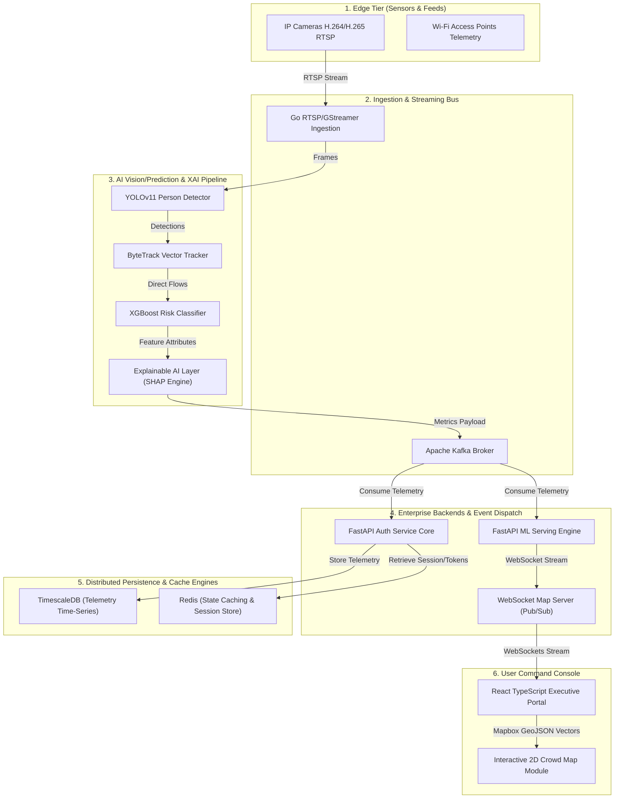
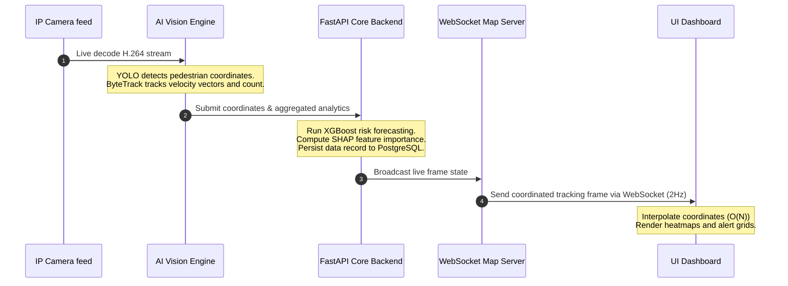

# NEXORA Platform Architecture

This document provides a comprehensive technical overview of the high-level and low-level architectural blueprints of the **NEXORA Predictive Crowd Intelligence & Decision Support Platform**.

---

## 1. High-Level Architecture (HLD)

NEXORA’s high-level architecture is engineered around the principles of low latency, high throughput, and decoupled microservices. The core flow ingests raw video packets from camera arrays, processes spatial detections on NVIDIA GPU nodes, runs XGBoost forecasting, compiles explaining weights, stores time-series telemetry blocks, and reflects live coordinates on client dashboards.

### 1.1 End-to-End System Topology

The logical and physical boundaries of the platform are divided into distinct tiers:

### 1.2 System Telemetry Sequence

The sequence details the step-by-step processing logic from frame ingestion to dashboard rendering:

---

## 2. Low-Level Architecture (LLD)

### 2.1 Backend Services Layout

NEXORA’s runtime is divided into modular services communicating via TLS-secured APIs:
1. **Core Gateway (`backend/auth`)**: Performs entry-level authentication, role-based validations (RBAC), and user session management. Also interfaces with PostgreSQL/TimescaleDB to read records and register active alerts.
2. **WebSocket Server (`backend/map`)**: Runs a dedicated async connection registry. Manages bidirectional communication (ping/pong updates) and concurrent coordinate broadcasting to multiple operator consoles.
3. **ML Prediction Engine (`backend/ai`)**: Serves model files, processes feature extraction vectors (density, occupancy and flow rates), and runs XGBoost classifications.
4. **Explainable API (`backend/ai/explainable_api.py`)**: Yields feature attribution details via SHAP to explain risk levels and caches repeat request calculations in a high-speed LFU/FIFO cache.
5. **Reports Generator (`backend/reports`)**: Runs server-side CSV compilers and HTML template systems.

### 2.2 Mathematical Specifications & Projections

#### Homography Coordinate Mapping
To represent camera pixel points on a physical top-down 2D map, the system maps pixel coordinates $(x_{pixel}, y_{pixel})$ to global georeferenced dashboard grid values $(X_{map}, Y_{map})$ using a $3 \times 3$ Projection Homography Matrix $H$:

$$\begin{bmatrix} X_{map} \\ Y_{map} \\ 1 \end{bmatrix} \approx H \begin{bmatrix} x_{pixel} \\ y_{pixel} \\ 1 \end{bmatrix}$$

$$H = \begin{bmatrix} h_{11} & h_{12} & h_{13} \\ h_{21} & h_{22} & h_{23} \\ h_{31} & h_{32} & h_{33} \end{bmatrix}$$

#### Heatmap Grid Rasterization
Crowd maps display density gradients using a Gaussian Kernel density estimation centered on each coordinate pin. The scalar density value $I$ at arbitrary location $\mathbf{p} = (X, Y)$ is defined as:

$$I(\mathbf{p}) = \sum_{i=1}^{N} w_i \cdot \exp\left(-\frac{\|\mathbf{p} - \mathbf{c}_i\|^2}{2\sigma^2}\right)$$

Where $\mathbf{c}_i$ represents the center point of pedestrian $i$, $w_i$ is the weight density factor, and $\sigma$ is the graphic kernel bandwidth adjusting scale based on map zoom levels.

#### Density-Weighted Dijkstra Path Routing
During emergency evacuation, simple shortest-path formulas can crowd escape routes and trigger crush scenarios. NEXORA adjusts route calculations dynamically using a density-weighted cost formula $W(e)$ for each corridor link $e$:

$$W(e) = L(e) \cdot \left[ 1 + \kappa \cdot \left( \frac{D(e)}{D_{critical}} \right)^\gamma \right]$$

Where:
* $L(e)$ is the physical length of the hallway or passage.
* $D(e)$ is the current real-time density in persons per square meter.
* $D_{critical}$ is the safe density threshold limit ($3.0\text{ persons/m}^2$).
* $\kappa$ (weight scale) and $\gamma$ (exponential penalty multiplier) are calibrating parameters.
