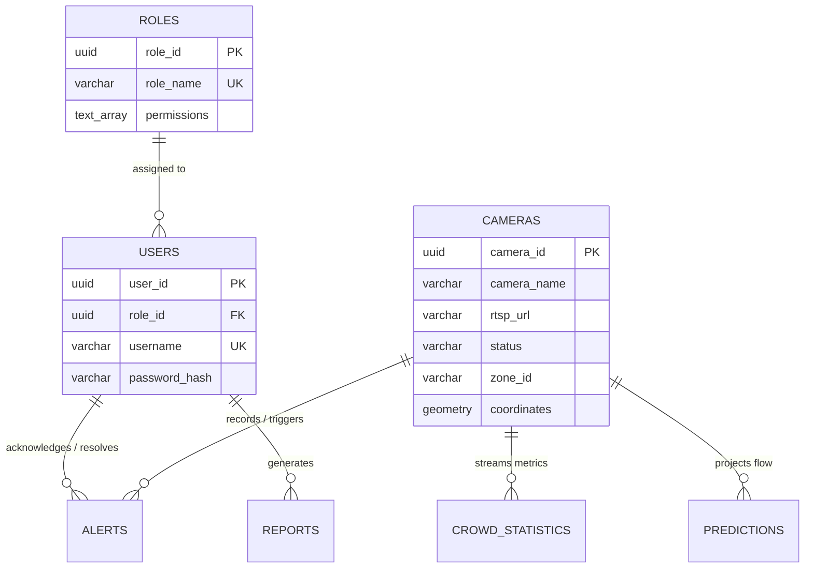

# NEXORA Database Architecture & Schema Specification

This document details the database layer configuration, TimescaleDB hypertable setups, DDL initialization scripts, and pool management configurations for the NEXORA platform.

---

## 1. Relational Entity Design

NEXORA’s persistence engine is split between standard relational SQL structures (for users, profiles, security roles, cameras metadata, and settings) and TimescaleDB partitions (for high-speed telemetry logs, predictive vectors, alerts timeline, and system events).



---

## 2. Table Specifications & DDL Schema

To initialize the NEXORA database structure, the following SQL script must be executed. This initiates PostgreSQL tables, activates spatial extensions, creates partitions, and sets indexes.

```sql
-- Enable PostGIS & TimescaleDB Extensions
CREATE EXTENSION IF NOT EXISTS postgis;
CREATE EXTENSION IF NOT EXISTS timescaledb CASCADE;

-- 1. Security Roles Table
CREATE TABLE roles (
    role_id UUID PRIMARY KEY DEFAULT gen_random_uuid(),
    role_name VARCHAR(64) UNIQUE NOT NULL,
    permissions TEXT[] NOT NULL
);

-- 2. Operators Accounts Table
CREATE TABLE users (
    user_id UUID PRIMARY KEY DEFAULT gen_random_uuid(),
    role_id UUID NOT NULL REFERENCES roles(role_id) ON DELETE RESTRICT,
    username VARCHAR(128) UNIQUE NOT NULL,
    email VARCHAR(256) UNIQUE NOT NULL,
    password_hash VARCHAR(256) NOT NULL,
    is_active BOOLEAN NOT NULL DEFAULT TRUE,
    created_at TIMESTAMP WITH TIME ZONE DEFAULT CURRENT_TIMESTAMP NOT NULL
);

-- 3. Cameras Metadata Registry
CREATE TABLE cameras (
    camera_id UUID PRIMARY KEY DEFAULT gen_random_uuid(),
    camera_name VARCHAR(128) NOT NULL,
    rtsp_url VARCHAR(512) NOT NULL,
    status VARCHAR(32) NOT NULL DEFAULT 'ACTIVE',
    zone_id VARCHAR(64) NOT NULL,
    coordinates GEOMETRY(POINT, 4326) NOT NULL,
    homography_matrix DOUBLE PRECISION[] NOT NULL,
    max_capacity INT NOT NULL DEFAULT 100,
    created_at TIMESTAMP WITH TIME ZONE DEFAULT CURRENT_TIMESTAMP NOT NULL
);

-- 4. Dynamic Live Alerts (TimescaleDB Hypertable)
CREATE TABLE crowd_alerts (
    alert_id UUID NOT NULL,
    camera_id UUID NOT NULL REFERENCES cameras(camera_id) ON DELETE CASCADE,
    timestamp TIMESTAMP WITH TIME ZONE NOT NULL,
    alert_type VARCHAR(64) NOT NULL,
    severity VARCHAR(16) NOT NULL,
    density_value DOUBLE PRECISION NOT NULL,
    status VARCHAR(32) NOT NULL DEFAULT 'CREATED',
    resolved_by UUID REFERENCES users(user_id) ON DELETE SET NULL,
    PRIMARY KEY (alert_id, timestamp)
);

-- 5. Crowd Metrics Log (TimescaleDB Hypertable)
CREATE TABLE crowd_analytics_log (
    stat_id UUID NOT NULL,
    camera_id UUID NOT NULL REFERENCES cameras(camera_id) ON DELETE CASCADE,
    timestamp TIMESTAMP WITH TIME ZONE NOT NULL,
    headcount INT NOT NULL,
    inflow_rate DOUBLE PRECISION NOT NULL,
    outflow_rate DOUBLE PRECISION NOT NULL,
    avg_velocity_x DOUBLE PRECISION NOT NULL,
    avg_velocity_y DOUBLE PRECISION NOT NULL,
    occupancy_pct DOUBLE PRECISION NOT NULL DEFAULT 0.0,
    queue_length INT NOT NULL DEFAULT 0,
    PRIMARY KEY (stat_id, timestamp)
);

-- 6. ML Forecasts Log (TimescaleDB Hypertable)
CREATE TABLE predictions (
    prediction_id UUID NOT NULL,
    camera_id UUID NOT NULL REFERENCES cameras(camera_id) ON DELETE CASCADE,
    timestamp TIMESTAMP WITH TIME ZONE NOT NULL,
    target_timestamp TIMESTAMP WITH TIME ZONE NOT NULL,
    predicted_headcount INT NOT NULL,
    predicted_density DOUBLE PRECISION NOT NULL,
    confidence_score DOUBLE PRECISION NOT NULL,
    explanation_factors JSONB NOT NULL,
    PRIMARY KEY (prediction_id, timestamp)
);

-- 7. Generated Reports Registry
CREATE TABLE reports (
    report_id UUID PRIMARY KEY DEFAULT gen_random_uuid(),
    generated_by UUID NOT NULL REFERENCES users(user_id) ON DELETE RESTRICT,
    created_at TIMESTAMP WITH TIME ZONE DEFAULT CURRENT_TIMESTAMP NOT NULL,
    report_type VARCHAR(64) NOT NULL,
    file_path VARCHAR(512) NOT NULL,
    metadata JSONB NOT NULL
);

-- Convert targeted tables to TimescaleDB partition Hypertables
SELECT create_hypertable('crowd_alerts', 'timestamp');
SELECT create_hypertable('crowd_analytics_log', 'timestamp');
SELECT create_hypertable('predictions', 'timestamp');
```

---

## 3. Query Performance & Indexing Strategy

To support sub-second query retrieval on dashboards under heavy telemetry load, the following specialized index structures are configured:

### 3.1 Spatial GIST Indexing
Geographic coordinate search on cameras (proximity and location queries) uses an R-Tree index via PostGIS GIST:
```sql
CREATE INDEX idx_cameras_geometry ON cameras USING GIST (coordinates);
```

### 3.2 Time-Series Composite B-Trees
TimescaleDB creates a default B-TREE database index on the `timestamp` column. To accelerate real-time dashboard searches mapping coordinate analytics blocks, composite indexes are set on the foreign key and timestamp columns together:
```sql
-- Speed up historical analytics queries on a single camera
CREATE INDEX idx_analytics_cam_time ON crowd_analytics_log (camera_id, timestamp DESC);

-- Speed up looking up active dashboard warnings on a zone
CREATE INDEX idx_alerts_lookup ON crowd_alerts (status, timestamp DESC);
CREATE INDEX idx_alerts_cam_time ON crowd_alerts (camera_id, timestamp DESC);
```

### 3.3 GIN Indexing for JSONB Forecasting
The SHAP explanation factors mapping in predictions are stored as JSONB nodes. We index them using Generalized Inverted Indexes (`GIN`) to optimize sub-key search performance:
```sql
CREATE INDEX idx_predictions_factors ON predictions USING GIN (explanation_factors);
```

---

## 4. Connection Pooling & Resource Configuration

Database connections are optimized for concurrency and safety parameters. The SQLAlchemy configuration features the following properties:

* **Engine Configuration**:
  ```python
  engine = create_engine(
      DATABASE_URL,
      pool_size=25,
      max_overflow=15,
      pool_timeout=30,
      pool_pre_ping=True,
      pool_recycle=1800
  )
  ```
* **Performance Parameters**:
  * **`pool_size=25`**: Dictates the baseline number of persistent database connections held open in the worker pool, preventing TCP connection startup latency on API queries.
  * **`max_overflow=15`**: Provides buffer capacity, allowing up to 15 spill-over transient connections when spikes of analytical writes saturate the main pool.
  * **`pool_pre_ping=True`**: Verifies socket viability before yielding connections. If a connection is closed due to idle network timeouts, the engine automatically replaces it, eliminating "Broken Pipe" or transactional exceptions.

---

## 5. Thread Safe Session Management

To prevent connection exhaustion and memory leakage, the services implement the context manager database session pattern. Database transactions are automatically committed on success and rolled back on exceptions:

```python
from contextlib import contextmanager

@contextmanager
def get_db_session():
    session = SessionLocal()
    try:
        yield session
        session.commit()
    except Exception:
        session.rollback()
        raise
    finally:
        session.close()
```
This guarantees that database connections return to the pool even during unhandled runtime exceptions.
