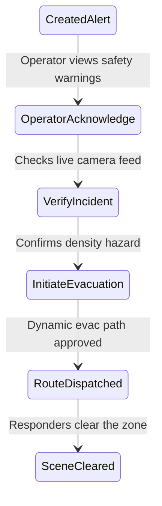

# NEXORA Operator User Manual

This manual guides security operators, dispatchers, and crowd coordinators on how to use the NEXORA platform.

---

## 1. Secure Authentication & Session Initialization

Access the platform command deck using your browser.

```
       +---------------------------------------------+
       |             NEXORA COMMAND LOGIN            |
       +---------------------------------------------+
       | Domain:    [ West Concourse Terminal  v ]   |
       | Operator:  [ operator_west_04           ]   |
       | Password:  [ ************************** ]   |
       |                                             |
       |             [ INITIATE SECURE SESSION ]     |
       +---------------------------------------------+
```

1. **Select Operations Domain**: Click the dropdown to match the target hub or venue segment.
2. **Key Operator Credentials**: Input your assigned Username or Operator ID and secure password.
3. **SSO Integration**: If your organization has corporate SSO configured, click "SSO Authenticate" to login via identity provider MFA.
4. **Session Lifetime**: For security, active sessions expire after 15 minutes of inactivity. The navbar display will alert you before automatic logout.

---

## 2. Operations Command Dashboard

The Operations Command Deck is segmented into three primary panels:

```
+======================================================================================+
| Live Camera Node (Left)   | 2D Coordinates Map View (Center)  | Alerts Panel (Right) |
+===========================+===================================+======================+
| Live streaming feed       | Pedestrian coordinates tracking   | Unacknowledged       |
| and status indicators     | and density heatmaps              | warnings feed        |
+---------------------------+-----------------------------------+----------------------+
```

### 2.1 Live Camera Panel (Left)
* Displays real-time MJPEG streams from active camera feeds.
* Displays counts, density (persons per square meter), and camera status indicators (`ONLINE`, `OFFLINE`).

### 2.2 Interactive 2D Map View (Center)
* Visualizes real-time coordinates generated by the AI vision engine.
* **Coordinate Interpolation**: Relies on a high-speed $O(N)$ lookup algorithm to interpolate movements smoothly at 60 FPS without dropping frames.
* **Density Heatmaps**: Visualizes density gradients (Green = Safe, Yellow = Warning, Red = Critical).
* **Overlay Options**: Use the toggle buttons to display or hide specific layout details (e.g. camera pins, flow vectors, evacuation route lines).

### 2.3 System Alerts Panel (Right)
* Lists active warnings and alerts requiring administrator review.
* Displays the estimated time-to-event, risk levels, and SHAP explainability insights.

---

## 3. Incident Management & Evacuation Workflows

When safety limits are breached, NEXORA triggers an alert workflow.



### 3.1 Reviewing and Acknowledging Alerts
1. Click an active alert in the right panel to show details.
2. Review the SHAP explanation panel describing the primary risk factors (e.g. "density bottleneck").
3. Click **"Acknowledge & Investigate"** to silence the console siren and claim the ticket. Your operator ID will be logged to the audit trail.

### 3.2 Activating Evacuation Routes
1. If the crowd hazard is verified, click **"Generate Evacuation Routing"**.
2. The pathfinder automatically calculates optimal egress paths using real-time density models to bypass congested bottlenecks.
3. Click **"Approve & Execute Evacuation Routing"** to dispatch instructions:
   * Exit directions are pushed to the **Field Responders mobile app**.
   * Directional arrows and notices are sent to **Digital Signage displays** in the affected zones.
   * Emergency audio announcements play via integrated **Public Address (PA)** systems.

---

## 4. Reports Engine & Analytics Exports

Analyze historical patterns and export compliance reports from the Reports Center.

```
       +---------------------------------------------+
       |            REPORTS CONFIGURATION            |
       +---------------------------------------------+
       | Date Range: [ Last 30 Days            v ]   |
       | Aggregation: [ Daily Summary           v ]   |
       | File Format: [ Styled HTML/PDF         v ]   |
       |                                             |
       |             [ GENERATE REPORT ]             |
       +---------------------------------------------+
```

1. **Select Type**: Choose Daily, Weekly, Monthly, or Incident-specific reports.
2. **Parameters**: Define the date range and select the target concourse, terminal, or individual camera arrays to evaluate.
3. **Format Options**:
   * **CSV Data Export**: Downloads raw historical telemetry matrices for external spreadsheet analysis.
   * **Print-Style HTML/PDF**: Generates styled reports containing key performance indicators (KPIs), incident graphs, and operator audit tables.
